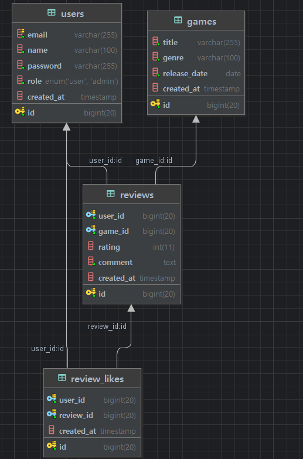

## 데이터베이스 구조
### 엔티티 관계도 (ERD)

데이터베이스는 다음 4개의 테이블로 구성되어 있습니다.

```
users: 사용자 정보 저장

games: 게임 정보 저장

reviews: 사용자가 작성한 게임 리뷰 정보

review_likes: 리뷰에 대한 좋아요 정보
```

### 관계

```
사용자(users)는 여러 리뷰(reviews)를 작성할 수 있습니다 (1:N)

게임(games)은 여러 리뷰(reviews)를 가질 수 있습니다 (1:N)

사용자(users)는 여러 리뷰에 좋아요(review_likes)를 할 수 있습니다 (1:N)

리뷰(reviews)는 여러 좋아요(review_likes)를 받을 수 있습니다 (1:N)
```

## 테이블 구조
### users 테이블

사용자 계정 정보를 저장합니다.
```
id: 사용자 고유 식별자 (PK)

email: 사용자 이메일 (UNIQUE)

name: 사용자 이름

password: 암호화된 비밀번호

role: 사용자 권한 ('USER' 또는 'ADMIN')

created_at: 계정 생성 시간
```
### games 테이블

게임 정보를 저장합니다.

```
id: 게임 고유 식별자 (PK)

title: 게임 제목

genre: 게임 장르

release_date: 게임 출시일

created_at: 데이터 생성 시간
```

### reviews 테이블

사용자가 게임에 대해 작성한 리뷰를 저장합니다.
```
id: 리뷰 고유 식별자 (PK)

user_id: 리뷰 작성자 ID (FK)

game_id: 리뷰 대상 게임 ID (FK)

rating: 게임 평점 (1~5)

comment: 리뷰 내용

created_at: 리뷰 작성 시간
```

### review_likes 테이블

리뷰에 대한 '좋아요' 정보를 저장합니다.
```
id: 좋아요 고유 식별자 (PK)

user_id: 좋아요를 누른 사용자 ID (FK)

review_id: 좋아요 대상 리뷰 ID (FK)

created_at: 좋아요 생성 시간

한 사용자는 특정 리뷰에 한 번만 좋아요 가능 (UNIQUE 제약조건)
```
